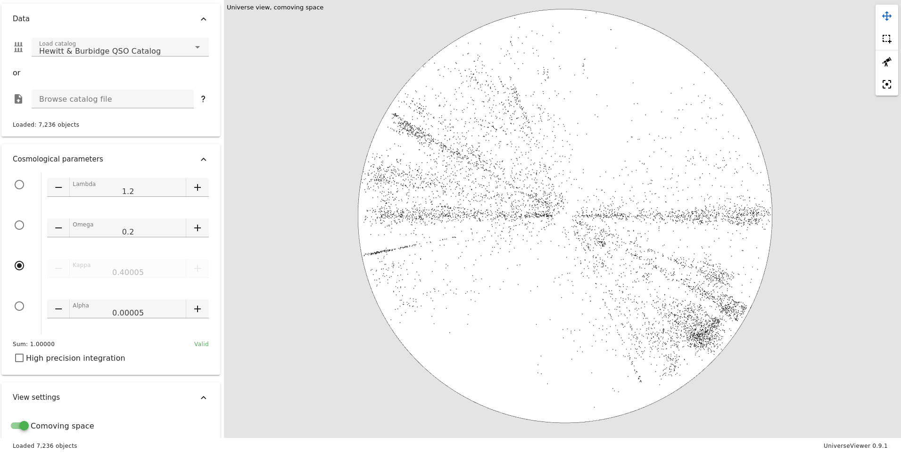

# Universe Viewer

Interactive software for the visualization and geodesic analysis of high-redshift astronomical objects.\
It makes it possible to produce a conformal mapping of cosmological structures, particularly quasars, taking into account the curvature of the universe.

[Try it from the official website !](https://universeviewer.com)

Universe Viewer is intended to be a working tool for researchers in cosmology; it relies on concepts from astronomy and general relativity.
It must produce a conformal map of the universe and make it possible to identify large-scale structures in reference or comoving space.



## Setup / deploy

To setup Universe Viewer on your own web server, get a release and unpack it in a served directory.
Universe Viewer must be served at root of your domain.

If you want to benefit from computation parallelization, your sever has to meet the following requirements:
- define `Cross-Origin-Opener-Policy` header to `same-origin`,
- define `Cross-Origin-Embedder-Policy` header to `require-corp`,
- use HTTPS.

Universe Viewer comes with a `.htaccess` file to enforce the required headers rules.

Moreover, parallelization needs client browser must support `SharedArrayBuffer` and Web Workers.

## Project Build

```sh
npm install
```

### Compile and Hot-Reload for Development

```sh
npm run dev
```

### Compile and Minify for Production

```sh
npm run build
```

### Lint with [ESLint](https://eslint.org/)

```sh
npm run lint
```

## References

[Framework for cosmography at high redshift](https://amu.hal.science/hal-01431981/document) (R. Triay, L. Spinelli and R. Lafaye, 1996).

## Catalogs

Here is a summary of included catalogs.

### Hewitt & Burbidge QSO Catalog

- **Authors:** A. Hewitt and G. Burbidge.
- **Date:** 1993.
- [Website](https://ui.adsabs.harvard.edu/abs/1993ApJS...87..451H/abstract)

### IRAS Point Source Catalog Redshift (PSCz)

- **Authors:** Saunders W., Sutherland W.J., Maddox S.J., Keeble O., Oliver S.J., Rowan-Robinson M., McMahon R.G., Efstathiou G.P., Tadros H., White S.D.M., Frenk C.S., Carraminana A., Hawkins M.R.S.
- **Date:** 2000.
- [Website](https://heasarc.gsfc.nasa.gov/w3browse/all/iraspscz.html)
- [More details here](/public/catalogs/vii_221_iraspscz/README.md)

### 2dF QSO Redshifr Survey

- **Authors:** Croom et al.
- **Date:** 2001
- [Website](http://www.2dfquasar.org)

### 6dF Galaxy Survey

- **Authors:** Jones et al.
- **Date:** 2009
- [Website](https://ui.adsabs.harvard.edu/abs/2009MNRAS.399..683J/abstract)
- [More details here](/public/catalogs/vii_259_6dF/README.md)

### Quasars and Active Galactic Nuclei (13th Ed.) (Veron-Cetty+)

- **Authors:** Veron-Cetty M.P., Veron P.
- **Date:** 2010
- [Website](https://ui.adsabs.harvard.edu/abs/2010yCat.7258....0V/abstract)
- [More details here](/public/catalogs/vii_258/README.md)

### 2MASS Redshift Survey

- **Authors:** Huchra J.P., Macri L.M., Masters K.L., Jarrett T.H., Berlind P., Calkins M., Crook A.C., Cutri R., Erdogdu P., Falco E., George T., Hutcheson C.M., Lahav O., Mader J., Mink J.D., Martimbeau N., Schneider S., Skrutskie M., Tokarz S., Westover M. <Astrophys. J. Suppl. 199, 26 (2012)>
- **Date:** 2012
- [Website](https://heasarc.gsfc.nasa.gov/W3Browse/all/twomassrsc.html)
- [More details here](/public/catalogs/twomassrsc/README.md)

### SDSS QSO Catalog: DR16Q (v3 Superset and v4)

- **Authors:** Lyke et al.
- **Date:** 2020
- [Website](https://www.sdss.org/dr16/algorithms/qso_catalog)
- [More details here](/public/catalogs/sdss_qso/README.md)

### Million Quasars Catalog, Version 8

- **Authors:** Eric W. Flesch
- **Date:** 2023
- [Website](https://quasars.org/milliquas.htm)
- [More details here](/public/catalogs/milliquas/README.md)

### Quaia: The Gaia-unWISE Quasar Catalog (G20.0 and G20.5)

- **Authors:** Storey-Fisher Kate, Hogg David W., Rix Hans-Walter, Eilers Anna-Christina, Fabbian Giulio, Blanton Michael, Alonso David
- **Date:** 2023
- [Website](https://zenodo.org/records/10403370)
- [More details here](/public/catalogs/quaia/README.md)
- **License:** Creative Commons Attribution 4.0 International

### AGN/QSO Value-Added Catalog for DESI DR1

- **Authors:** DESI Collaboration et al.
- **Date:** 2025
- [Website](https://data.desi.lbl.gov/doc/releases/dr1/vac/agnqso)
- [More details here](/public/catalogs/agnqso_desi/README.md)
- **License:** Creative Commons Attribution 4.0 International License
